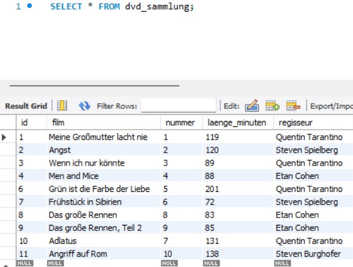
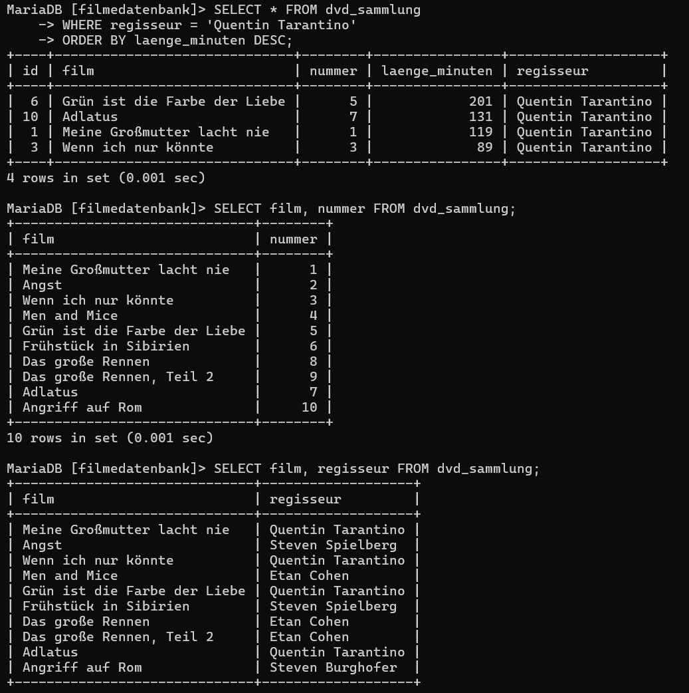
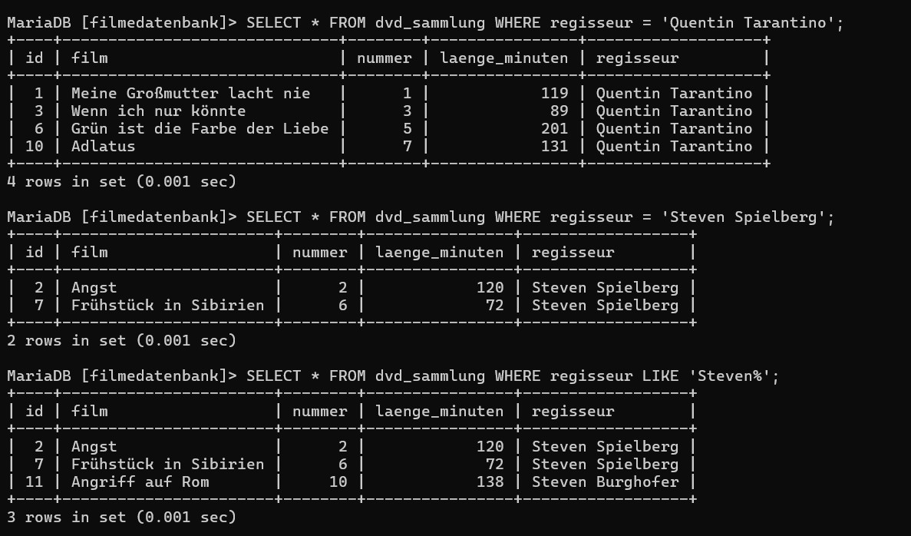
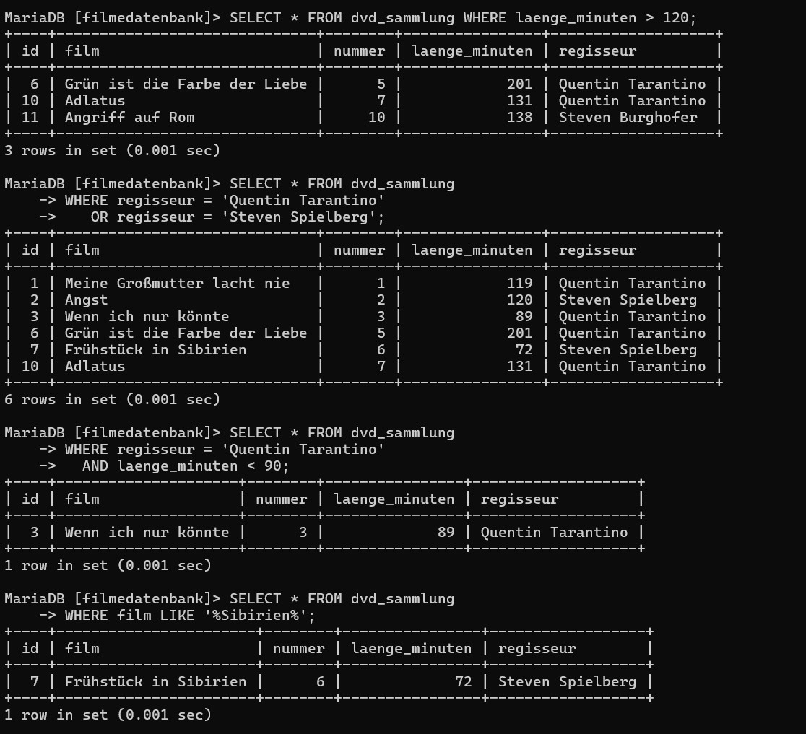
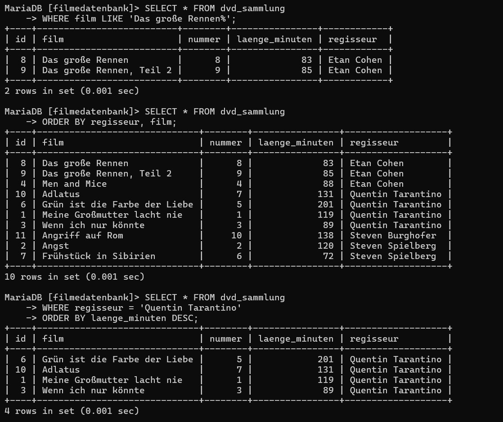
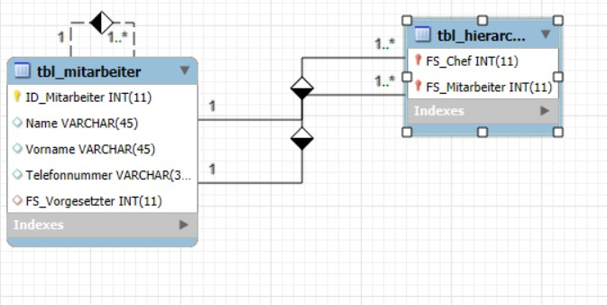

## Aufgabe Datentype

| **Datentyp**                                        | **MariaDB (MySQL)**           | **Beispiel**                 | **Bemerkung / Einstellungen**                                  |
|-----------------------------------------------------|-------------------------------|------------------------------|----------------------------------------------------------------|
| Ganze Zahlen                                        | INT, TINYINT, SMALLINT        | INT: 42                      | signed/unsigned möglich                                       |
| Natürliche Zahlen                                   | INT UNSIGNED                  | 42                           | Nur positive Zahlen                                            |
| Festkommazahlen (Dezimalzahlen)                     | Decimal(M[,D])                | Decimal(6,2) 1234.56         | M = Gesamte Anzahl Stellen, D = Nachkommastellen              |
| Aufzählungstypen                                    | ENUM('Wert1', 'Wert2', ...)   | ENUM('rot','grün','blau')   | Nur vordefinierte Werte erlaubt                               |
| Boolean (logische Werte)                            | BOOLEAN, BOOL, TINYINT(1)     | TRUE / FALSE                 | BOOL ist Alias für TINYINT(1)                                 |
| Zeichen (einzelnes Zeichen)                         | CHAR(1)                       | 'A'                          | Feste Länge, hier: 1 Zeichen                                  |
| Gleitkommazahlen                                    | FLOAT, DOUBLE                 | FLOAT: 3.14                  | FLOAT ≈ 7 Stellen, DOUBLE ≈ 15 Stellen Genauigkeit             |
| Zeichenkette fester Länge                           | CHAR(n)                       | CHAR(10)                     | Mit Leerzeichen aufgefüllt                                    |
| Zeichenkette variabler Länge                        | VARCHAR(n)                    | VARCHAR(255)                 | Maximale Länge in n                                           |
| Datum und/oder Zeit                                 | DATE, TIME, DATETIME          | '2023-01-01', '12:30:00'     | Für Datum & Zeitwerte                                         |
| Zeitstempel                                         | TIMESTAMP                     | CURRENT_TIMESTAMP            | Speichert aktuelle Zeit automatisch                          |
| Binäre Datenobjekte variabler Länge (z.B. Bild)     | BLOB                          | BLOB                         | Für Binärdaten (z.B. Bilder, Dateien)                         |
| Verbund                                             | SET('Wert1', 'Wert2', ...)    | SET('a','b','c')             | Kombination aus mehreren vordefinierten Werten erlaubt        |
| JSON                                                | JSON                          | '{ "name": "Max" }'         | Ab MariaDB 10.2.7, intern als LONGTEXT gespeichert             |

---
## Auftrag Insert 

### **a. Heinrich Schmitt aus Zürich, Schweiz (Kurzform)**

```
INSERT INTO kunden VALUES (NULL, 'Heinrich', 'Schmitt', 2, 'Zürich');
```

---

### **b. Sabine Müller aus Bern, Schweiz (Kurzform)**

```
INSERT INTO kunden VALUES (NULL, 'Sabine', 'Müller', 2, 'Bern');
```

---

### **c. Markus Mustermann aus Wien, Österreich (Kurzform)**

```
INSERT INTO kunden VALUES (NULL, 'Markus', 'Mustermann', 1, 'Wien');
```

---

### **d. Herr Maier (Langform – nur Nachname bekannt)**

```
INSERT INTO kunden (nachname) VALUES ('Maier');
```

---

### **e. Herr Bulgur aus Sirnach (Langform – Nachname und Wohnort)**

```
INSERT INTO kunden (nachname, wohnort) VALUES ('Bulgur', 'Sirnach');
```

---

### **f. Maria Manta (Langform – Vorname und Nachname)**

```
INSERT INTO kunden (vorname, nachname) VALUES ('Maria', 'Manta');
```
---
## Frahgeb mit fehler finden:


### **a. Fehler: Fehlender Tabellenname**

```
-- Fehlerhaft:
INSERT INTO (nachname, wohnort, land_id) VALUES ('Fesenkampp', 'Duis-burg', 3);
-- Korrekt:
INSERT INTO kunden (nachname, wohnort, land_id) VALUES ('Fesenkampp', 'Duis-burg', 3);
```

---

### **b. Fehler: Spaltenname in einfachen Hochkommas (' ') statt ohne oder mit `Backticks`**

```
-- Fehlerhaft:
INSERT INTO kunden ('vorname') VALUES ('Herbert');
-- Korrekt:
INSERT INTO kunden (vorname) VALUES ('Herbert');
```

---

### **c. Fehler: 'Deutschland' als String statt einer passenden `land_id` (z. B. 3)**

```
-- Fehlerhaft:
INSERT INTO kunden (nachname, vorname, wohnort, land_id) VALUES ('Schulter', 'Albert', 'Duisburg', 'Deutschland');
-- Korrekt (angenommen land_id für Deutschland ist 3):
INSERT INTO kunden (nachname, vorname, wohnort, land_id) VALUES ('Schulter', 'Albert', 'Duisburg', 3);
```

---

### **d. Fehler: Kein Tabellenname, leeres Feld, falsche Anzahl Spalten**

```
-- Fehlerhaft:
INSERT INTO kunden ('', 'Brunhild', 'Sulcher', 1, 'Süderstade');
-- Korrekt:
INSERT INTO kunden (vorname, nachname, land_id, wohnort) VALUES ('Brunhild', 'Sulcher', 1, 'Süderstade');
```

---

### **e. Fehler: Keine Angabe der Spalten, falsche Reihenfolge der Werte**

```
-- Fehlerhaft:
INSERT INTO kunden VALUES ('Jochen', 'Schmied', 2, 'Solingen');
-- Korrekt (AUTO_INCREMENT beachten!):
INSERT INTO kunden (vorname, nachname, land_id, wohnort) VALUES ('Jochen', 'Schmied', 2, 'Solingen');
```

---

### **f. Fehler: Leerer Primärschlüssel ('') – besser: NULL oder Kurzform**

```
-- Fehlerhaft:
INSERT INTO kunden VALUES ('', 'Doppelbrecher', 2, '');
-- Korrekt:
INSERT INTO kunden (nachname, land_id) VALUES ('Doppelbrecher', 2);
```

---

### **g. Fehler: Zu viele Werte für zu wenig Spalten**

```
-- Fehlerhaft:
INSERT INTO kunden (nachname, wohnort, land_id) VALUES ('Christoph', 'Fesenkampp', 'Duisburg', 3);
-- Korrekt:
INSERT INTO kunden (nachname, wohnort, land_id) VALUES ('Christoph', 'Fesenkampp', 3);
```

---

### **h. Dieser Befehl ist korrekt!**

```
-- Korrekt:
INSERT INTO kunden (vorname) VALUES ('Herbert');
```

---

### **i. Fehler: Fehlende Anführungszeichen um Werte**

```
-- Fehlerhaft:
INSERT INTO kunden (nachname, vorname, wohnort, land_id) VALUES (Schulter, Albert, Duisburg, 1);
-- Korrekt:
INSERT INTO kunden (nachname, vorname, wohnort, land_id) VALUES ('Schulter', 'Albert', 'Duisburg', 1);
```

---

### **j. Fehler: `VALUE` statt `VALUES`, keine Spalten angegeben, leeres Feld**

```
-- Fehlerhaft:
INSERT INTO kunden VALUE ('', "Brunhild", "Sulcher", 1, "Süderstade");
-- Korrekt:
INSERT INTO kunden (vorname, nachname, land_id, wohnort) VALUES ('Brunhild', 'Sulcher', 1, 'Süderstade');
```

---

### **k. Fehler: `VALUE` statt `VALUES`, kein AUTO_INCREMENT-Wert nötig, unquotierter String**

```
-- Fehlerhaft:
INSERT INTO kunden VALUE ('', 'Jochen', 'Schmied', 2, Solingen);
-- Korrekt:
INSERT INTO kunden (vorname, nachname, land_id, wohnort) VALUES ('Jochen', 'Schmied', 2, 'Solingen');
```
--
## Auftrag DROP, ALTER, Update
```
--  Regisseurname „Cohen“ vervollständigen zu „Etan Cohen“

UPDATE dvd_sammlung
SET regisseur = 'Etan Cohen'
WHERE regisseur = 'Cohen';
```
```
-- Filmlänge von „Angst“ korrigieren auf 120 Minuten
UPDATE dvd_sammlung
SET laenge_minuten = 120
WHERE film = 'Angst';
```
```
-- Tabelle umbenennen in „bluray_sammlung“
RENAME TABLE dvd_sammlung TO bluray_sammlung;
```
```
--  Spalte „Preis“ hinzufügen
ALTER TABLE bluray_sammlung
ADD COLUMN preis DECIMAL(5,2);
```
```
--  Film „Angriff auf Rom“ entfernen
DELETE FROM bluray_sammlung
WHERE film = 'Angriff auf Rom';
```
```

-- Spalte „film“ umbenennen in „kinofilme“
ALTER TABLE bluray_sammlung
CHANGE COLUMN film kinofilme VARCHAR(255) NOT NULL;
```
```
-- Spalte „nummer“ löschen
ALTER TABLE bluray_sammlung
DROP COLUMN nummer;
```
```
-- Tabelle komplett löschen, da Firma geschlossen wurde
DROP TABLE bluray_sammlung;
```
---

 ## Auftrag SELECT

### **a. Alle Datensätze der DVD-Sammlung anzeigen**
```sql
SELECT * FROM dvd_sammlung;
```

---

### **b. Nur Filmtitel und zugehörige Nummer**
```sql
SELECT film, nummer FROM dvd_sammlung;
```

---

### **c. Nur Filmtitel und zugehöriger Regisseur**
```sql
SELECT film, regisseur FROM dvd_sammlung;
```

---

### **d. Alle Filme von Quentin Tarantino**
```sql
SELECT * FROM dvd_sammlung WHERE regisseur = 'Quentin Tarantino';
```

---

### **e. Alle Filme von Steven Spielberg**
```sql
SELECT * FROM dvd_sammlung WHERE regisseur = 'Steven Spielberg';
```

---

### **f. Filme, in denen der Regisseur den Vornamen "Steven" hat**
```sql
SELECT * FROM dvd_sammlung WHERE regisseur LIKE 'Steven%';
```

---

### **g. Filme, die länger als 2 Stunden sind (also über 120 Minuten)**
```sql
SELECT * FROM dvd_sammlung WHERE laenge_minuten > 120;
```

---

### **h. Filme von Tarantino oder Spielberg**
```sql
SELECT * FROM dvd_sammlung 
WHERE regisseur = 'Quentin Tarantino' 
   OR regisseur = 'Steven Spielberg';
```

---

### **i. Filme von Tarantino, die kürzer als 90 Minuten sind**
```sql
SELECT * FROM dvd_sammlung 
WHERE regisseur = 'Quentin Tarantino' 
  AND laenge_minuten < 90;
```

---

### **j. Film mit dem Wort "Sibirien" im Titel**
```sql
SELECT * FROM dvd_sammlung 
WHERE film LIKE '%Sibirien%';
```

---

### **k. Alle Teile von "Das große Rennen"**
```sql
SELECT * FROM dvd_sammlung 
WHERE film LIKE 'Das große Rennen%';
```

---

### **l. Filme sortiert nach Regisseur**
```sql
SELECT * FROM dvd_sammlung 
ORDER BY regisseur;
```

---

### **m. Filme sortiert nach Regisseur, dann nach Titel**
```
SELECT * FROM dvd_sammlung 
ORDER BY regisseur, film;
```

---

### **n. Filme von Tarantino, sortiert nach Länge (längste zuerst)**
```sql
SELECT * FROM dvd_sammlung 
WHERE regisseur = 'Quentin Tarantino' 
ORDER BY laenge_minuten DESC;
```
---
## Resultate:








## Auftrag - Erweiterter Tourenplaner mit Daten füllen



```
INSERT INTO tbl_Mitarbeiter (ID_Mitarbeiter, Vorname, Name, Telefonnummer)
VALUES
(1, 'Hans', 'Muster', '+41 76 764 23 23'),
(2, 'Theo', 'Dohr', '+41 79 324 55 78'),
(3, 'Justin', 'Biber', '+41 79 872 12 32'),
(4, 'Johann S.', 'Fluss', '+41 79 298 98 76'),
(5, 'Diana', 'Knecht', '+41 78 323 77 00'),
(6, 'Anna', 'Schöni', '+41 76 569 67 80'),
(8, 'Lucy', 'Schmidt', '+49 420 232 2232'),
(9, 'Ardit', 'Azubi', NULL);
```
 für Disponenten-Chefin (Anna Schöni):
```
-- Disponenten unter Anna Schöni
UPDATE tbl_Mitarbeiter
SET FS_Vorgesetzter = (
    SELECT ID_Mitarbeiter
    FROM tbl_Mitarbeiter
    WHERE Vorname = 'Anna' AND Name = 'Schöni'
)
WHERE ID_Mitarbeiter IN (
    SELECT ID_Mitarbeiter
    FROM tbl_Mitarbeiter
    WHERE (Vorname = 'Lucy' AND Name = 'Schmidt')
       OR (Vorname = 'Hans' AND Name = 'Muster')
);
```
```
-- Fahrer unter Theo Dohr
UPDATE tbl_Mitarbeiter
SET FS_Vorgesetzter = (
    SELECT ID_Mitarbeiter
    FROM tbl_Mitarbeiter
    WHERE Vorname = 'Theo' AND Name = 'Dohr'
)
WHERE ID_Mitarbeiter IN (
    SELECT ID_Mitarbeiter
    FROM tbl_Mitarbeiter
    WHERE (Vorname = 'Diana' AND Name = 'Knecht')
       OR (Vorname = 'Johann S.' AND Name = 'Fluss')
       OR (Vorname = 'Hans' AND Name = 'Muster')
);
```
tbl_Hierarchie Einträge
```
INSERT INTO tbl_Hierarchie (FS_Chef, FS_Mitarbeiter)
VALUES
(6, 1), -- Anna Schöni → Hans Muster
(6, 8), -- Anna Schöni → Lucy Schmidt
(2, 1), -- Theo Dohr → Hans Muster
(2, 4), -- Theo Dohr → Johann S. Fluss
(2, 5); -- Theo Dohr → Diana Knecht

```

