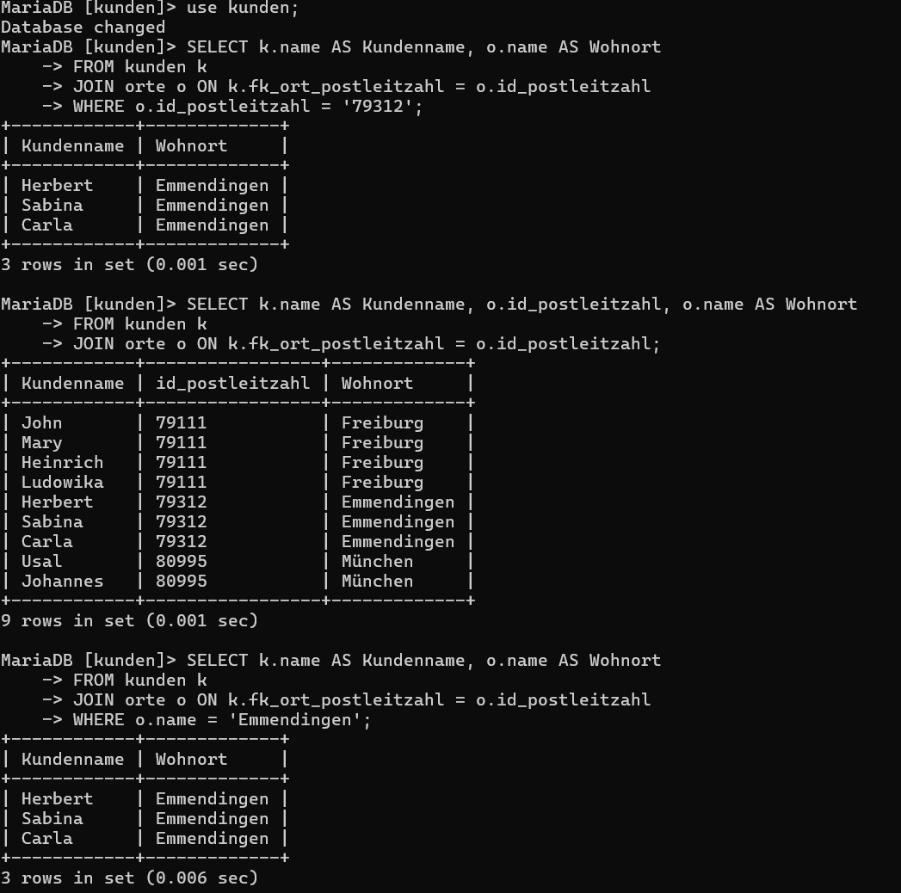
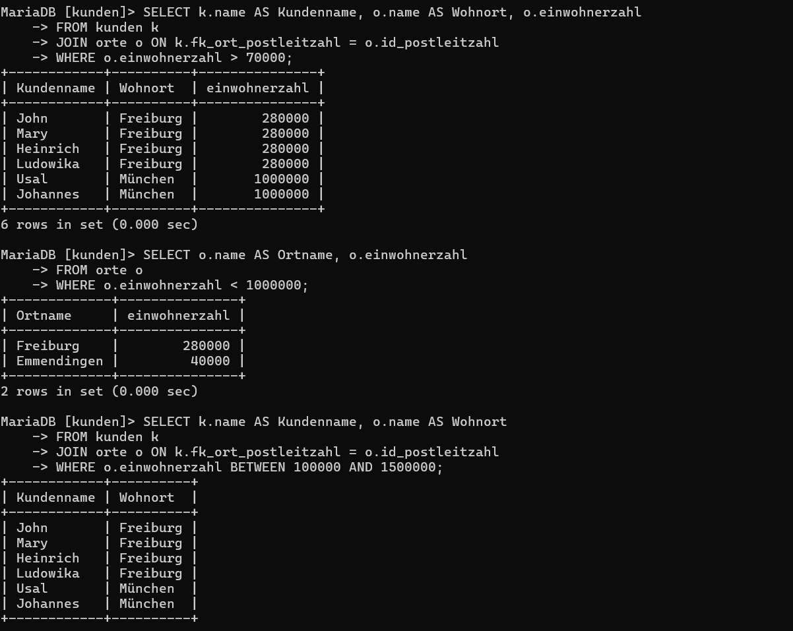
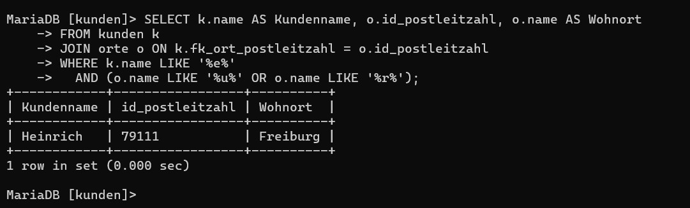
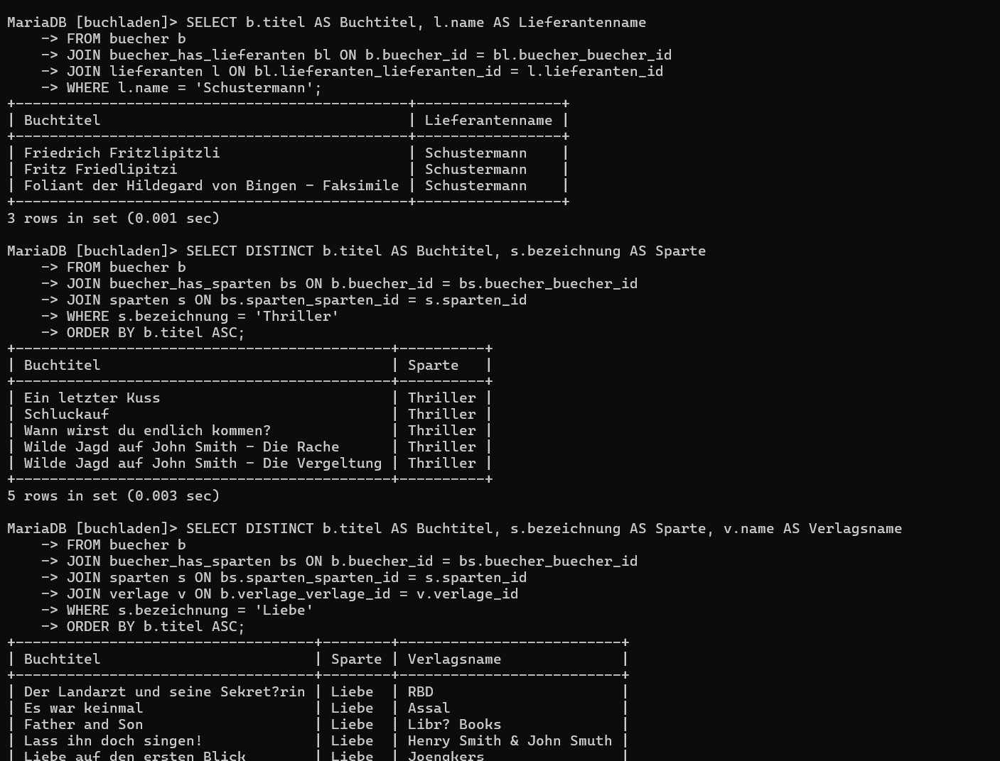

**Frage:**  
Warum gibt diese Abfrage kein sinnvolles Ergebnis?

```sql
SELECT * FROM kunden
INNER JOIN orte;
```

**Antwort:**  
Weil keine Verknüpfungsbedingung angegeben ist!  
Das heißt: Jede Zeile aus `kunden` wird mit **jeder** Zeile aus `orte` kombiniert → ein **kartesisches Produkt** entsteht.  
Die Ergebnisse passen dann nicht logisch zusammen (z. B. ein Kunde aus Hamburg wird plötzlich einem Ort Emmendingen zugeordnet), und es entstehen sehr viele unnötige Kombinationen.

Man muss die Tabellen sinnvoll verbinden, etwa so:

```sql
SELECT * FROM kunden
INNER JOIN orte ON kunden.fk_ort_postleitzahl = orte.id_postleitzahl;
```

---

**a) Name, Postleitzahl und Wohnort aller Kunden**

```sql
SELECT k.name AS Kundenname, o.id_postleitzahl, o.name AS Wohnort
FROM kunden k
JOIN orte o ON k.fk_ort_postleitzahl = o.id_postleitzahl;
```

---

**b) Name und Wohnort aller Kunden, die Postleitzahl 79312 haben**

```sql
SELECT k.name AS Kundenname, o.name AS Wohnort
FROM kunden k
JOIN orte o ON k.fk_ort_postleitzahl = o.id_postleitzahl
WHERE o.id_postleitzahl = '79312';
```

---

**c) Name und Wohnort aller Kunden, die in Emmendingen wohnen**

```sql
SELECT k.name AS Kundenname, o.name AS Wohnort
FROM kunden k
JOIN orte o ON k.fk_ort_postleitzahl = o.id_postleitzahl
WHERE o.name = 'Emmendingen';
```

---

**d) Name, Wohnort und Einwohnerzahl für Kunden in Orten mit mehr als 70000 Einwohnern**

```sql
SELECT k.name AS Kundenname, o.name AS Wohnort, o.einwohnerzahl
FROM kunden k
JOIN orte o ON k.fk_ort_postleitzahl = o.id_postleitzahl
WHERE o.einwohnerzahl > 70000;
```

---

**e) Alle Orte, die weniger als 1.000.000 Einwohner haben**

```sql
SELECT o.name AS Ortname, o.einwohnerzahl
FROM orte o
WHERE o.einwohnerzahl < 1000000;
```

---

**f) Kundename und Ortname für Kunden in Orten mit 100.000 bis 1.500.000 Einwohnern**

```sql
SELECT k.name AS Kundenname, o.name AS Wohnort
FROM kunden k
JOIN orte o ON k.fk_ort_postleitzahl = o.id_postleitzahl
WHERE o.einwohnerzahl BETWEEN 100000 AND 1500000;
```

---

**g) Kunden und Orte mit Bedingung auf Buchstaben ("e" in Kundenname UND "u" oder "r" im Ortsname)**

```sql
SELECT k.name AS Kundenname, o.id_postleitzahl, o.name AS Wohnort
FROM kunden k
JOIN orte o ON k.fk_ort_postleitzahl = o.id_postleitzahl
WHERE k.name LIKE '%e%'
  AND (o.name LIKE '%u%' OR o.name LIKE '%r%');
```

---


## Resultate Auftrag SELECT-JOIN:




---
### 1. Lieferanten in Freiburg

```sql
SELECT l.name AS Lieferantenname, o.name AS Lieferantenort, o.postleitzahl
FROM lieferanten l
JOIN orte o ON l.orte_orte_id = o.orte_id
WHERE o.name = 'Freiburg';
```

---

### 2. Verlage in München

```sql
SELECT v.name AS Verlagsname, o.name AS Verlagsort
FROM verlage v
JOIN orte o ON v.orte_orte_id = o.orte_id
WHERE o.name = 'München';
```

---

### 3. Bücher des Verlags „Assal“

```sql
SELECT b.titel AS Buchtitel, b.erscheinungsjahr, v.name AS Verlagsname
FROM buecher b
JOIN verlage v ON b.verlage_verlage_id = v.verlage_id
WHERE v.name = 'Assal'
ORDER BY b.erscheinungsjahr DESC;
```

---

### 4. Bücher des Lieferanten „Schustermann“

```sql
SELECT b.titel AS Buchtitel, l.name AS Lieferantenname
FROM buecher b
JOIN buecher_has_lieferanten bl ON b.buecher_id = bl.buecher_buecher_id
JOIN lieferanten l ON bl.lieferanten_lieferanten_id = l.lieferanten_id
WHERE l.name = 'Schustermann';
```

---

### 5. Alle Thriller

```sql
SELECT DISTINCT b.titel AS Buchtitel, s.bezeichnung AS Sparte
FROM buecher b
JOIN buecher_has_sparten bs ON b.buecher_id = bs.buecher_buecher_id
JOIN sparten s ON bs.sparten_sparten_id = s.sparten_id
WHERE s.bezeichnung = 'Thriller'
ORDER BY b.titel ASC;
```

---

### 6. Alle Liebesromane

```sql
SELECT DISTINCT b.titel AS Buchtitel, s.bezeichnung AS Sparte, v.name AS Verlagsname
FROM buecher b
JOIN buecher_has_sparten bs ON b.buecher_id = bs.buecher_buecher_id
JOIN sparten s ON bs.sparten_sparten_id = s.sparten_id
JOIN verlage v ON b.verlage_verlage_id = v.verlage_id
WHERE s.bezeichnung = 'Liebe'
ORDER BY b.titel ASC;
```

---

### 7. Bücher von Sabrina Müller

```sql
SELECT a.nachname AS Autorennachname, a.vorname AS Autorenvorname, b.titel AS Buchtitel
FROM autoren a
JOIN autoren_has_buecher ab ON a.autoren_id = ab.autoren_autoren_id
JOIN buecher b ON ab.buecher_buecher_id = b.buecher_id
WHERE a.vorname = 'Sabrina' AND a.nachname = 'Müller'
ORDER BY b.titel DESC;
```

---

### 8. Thriller von Sabrina Müller

```sql
SELECT a.vorname AS Autorenvorname, a.nachname AS Autorennachname, b.titel AS Buchtitel, s.bezeichnung AS Sparte
FROM autoren a
JOIN autoren_has_buecher ab ON a.autoren_id = ab.autoren_autoren_id
JOIN buecher b ON ab.buecher_buecher_id = b.buecher_id
JOIN buecher_has_sparten bs ON b.buecher_id = bs.buecher_buecher_id
JOIN sparten s ON bs.sparten_sparten_id = s.sparten_id
WHERE a.vorname = 'Sabrina' AND a.nachname = 'Müller' AND s.bezeichnung = 'Thriller';
```

---

### 9. Bücher von Sabrina Müller in den Sparten Thriller oder Humor

```sql
SELECT a.vorname AS Autorenvorname, a.nachname AS Autorennachname, b.titel AS Buchtitel, GROUP_CONCAT(DISTINCT s.bezeichnung) AS Sparten
FROM autoren a
JOIN autoren_has_buecher ab ON a.autoren_id = ab.autoren_autoren_id
JOIN buecher b ON ab.buecher_buecher_id = b.buecher_id
JOIN buecher_has_sparten bs ON b.buecher_id = bs.buecher_buecher_id
JOIN sparten s ON bs.sparten_sparten_id = s.sparten_id
WHERE a.vorname = 'Sabrina' AND a.nachname = 'Müller' AND s.bezeichnung IN ('Thriller', 'Humor')
GROUP BY b.titel
ORDER BY b.titel ASC;
```

## Resultate Auftrag SELECT-JOIN(Fortgeschrittene ):



