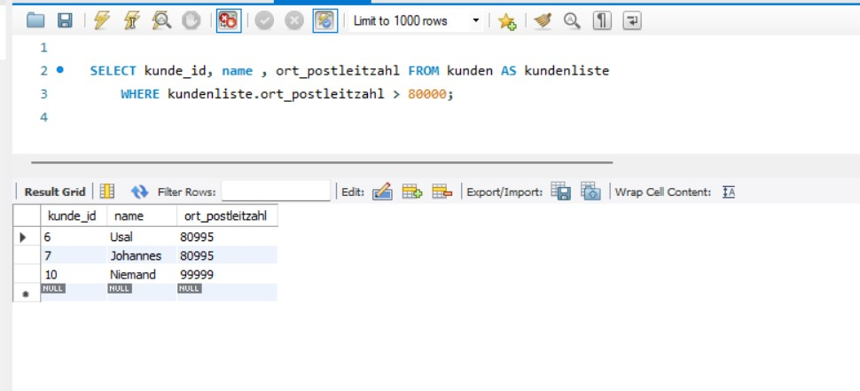

Ergänzen Sie folgende Statements und überprüfen Sie die Funktion:

SELECT \__________________\_ FROM kunden AS kundenliste 
    WHERE kundenliste.ort_postleitzahl \> 80000
    \-- ausgegeben werden sollen kunde_id, Name des Kunden und Postleitzahl des Kunden

SELECT o.name, k.name FROM \__________________\_ 
     WHERE o.name LIKE '%n' AND o.postleitzahl = k.ort_postleitzahl

Korrigieren Sie die folgenden Statements, dass sie funktionieren.

\-- Aliasse 'prfz' und 'hrgs' bitte nicht verändern!
SELECT kunde_id, kunden.name, orte.name FROM kunden AS hrgs 
    INNER JOIN ort AS prfz 
    ON o.postleitzahl = k.ort_postleitzahl 
    ORDER BY k.kunde_id

    \-- Fügen Sie alle möglichen und notwendigen Aliasse ein!

    SELECT k.name, o.postleitzahl, o.name FROM kunden, orte WHERE k.name LIKE '%a%' AND o.name LIKE '%u%' AND k.ort_postleitzahl = o.postleitzahl

