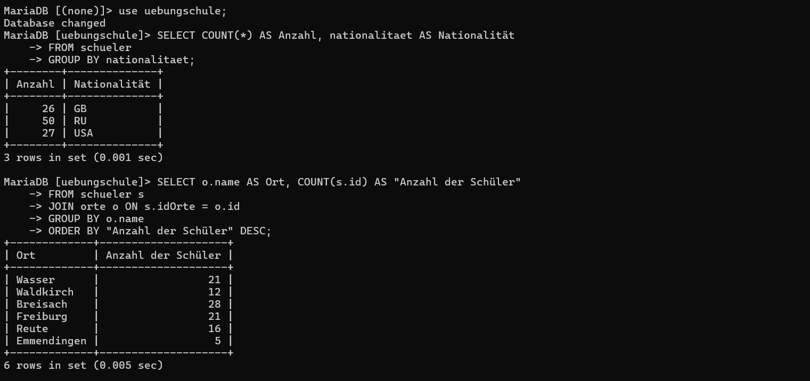
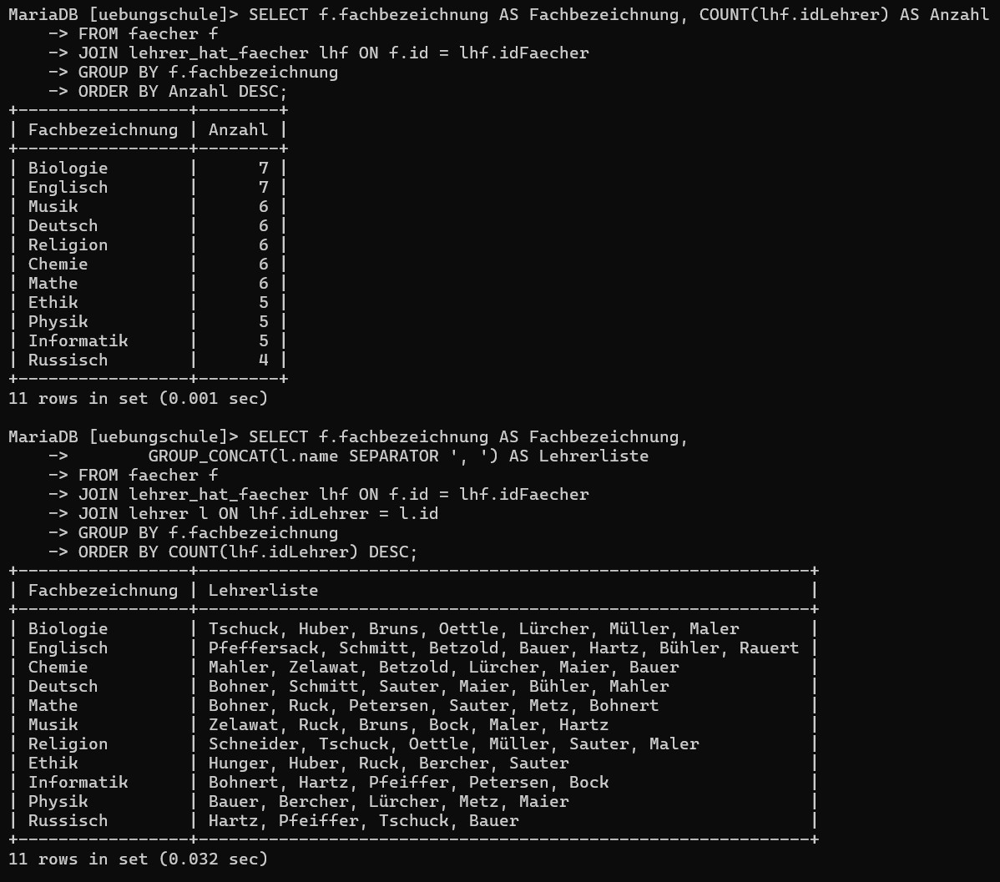
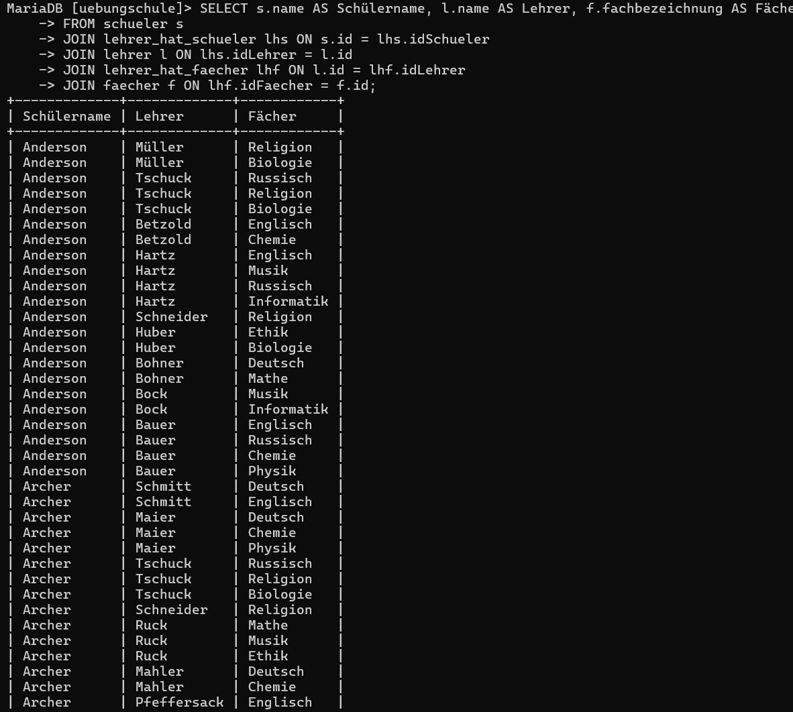

### 1. Anzahl aller Schüler, gruppiert nach Nationalität

```sql
SELECT COUNT(*) AS Anzahl, nationalitaet AS Nationalität
FROM schueler
GROUP BY nationalitaet;
```

---

### 2. Wie viele Schüler wohnen in den einzelnen Orten?  


```sql
SELECT o.name AS Ort, COUNT(s.id) AS "Anzahl der Schüler"
FROM schueler s
JOIN orte o ON s.idOrte = o.id
GROUP BY o.name
ORDER BY "Anzahl der Schüler" DESC;
```

---

### 3. Wie viele Lehrer unterrichten die einzelnen Fächer?  


```sql
SELECT f.fachbezeichnung AS Fachbezeichnung, COUNT(lhf.idLehrer) AS Anzahl
FROM faecher f
JOIN lehrer_hat_faecher lhf ON f.id = lhf.idFaecher
GROUP BY f.fachbezeichnung
ORDER BY Anzahl DESC;
```

---

### 4. Welche Lehrer unterrichten welche Fächer?  

```sql
SELECT f.fachbezeichnung AS Fachbezeichnung,
       GROUP_CONCAT(l.name SEPARATOR ', ') AS Lehrerliste
FROM faecher f
JOIN lehrer_hat_faecher lhf ON f.id = lhf.idFaecher
JOIN lehrer l ON lhf.idLehrer = l.id
GROUP BY f.fachbezeichnung
ORDER BY COUNT(lhf.idLehrer) DESC;
```
---

### 5. Schülernamen + ihre Fächer + Lehrer  

```sql
SELECT s.name AS Schülername, l.name AS Lehrer, f.fachbezeichnung AS Fächer
FROM schueler s
JOIN lehrer_hat_schueler lhs ON s.id = lhs.idSchueler
JOIN lehrer l ON lhs.idLehrer = l.id
JOIN lehrer_hat_faecher lhf ON l.id = lhf.idLehrer
JOIN faecher f ON lhf.idFaecher = f.id;
```



