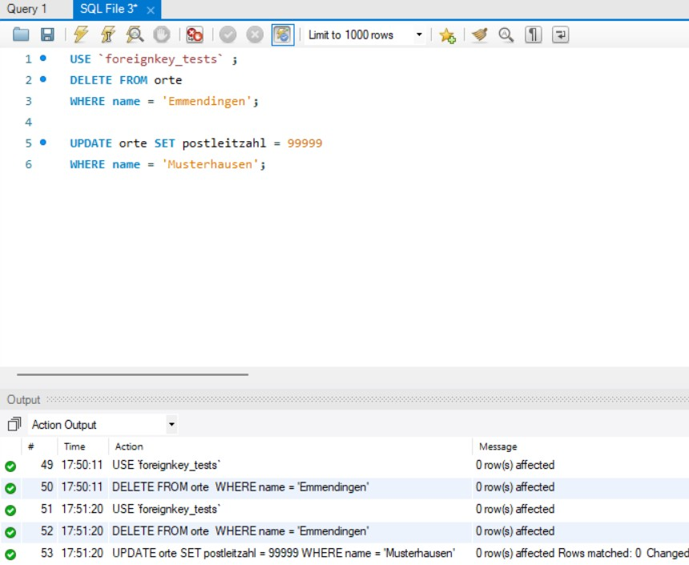
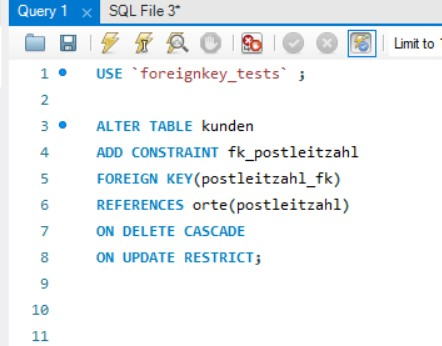

### 1. **Wie wird beim Fremdschlüssel der Constraint NOT NULL erstellt?**
Der **NOT NULL Constraint** wird direkt bei der Definition der Spalte in der Tabelle gesetzt. Er stellt sicher, dass die Spalte keinen `NULL`-Wert enthalten darf.

#### Beispiel:
```
CREATE TABLE Bestellung (
    BestellID INT PRIMARY KEY,
    KundenID INT NOT NULL,  -- NOT NULL Constraint
    Bestelldatum DATE,
    FOREIGN KEY (KundenID) REFERENCES Kunde(KundenID)
);
```

- **`KundenID INT NOT NULL`:** Die Spalte `KundenID` darf keinen `NULL`-Wert enthalten.
- **`FOREIGN KEY`:** Verweist auf die `KundenID` in der Tabelle `Kunde`.

---

### 2. **Weshalb wird für jeden Fremdschlüssel ein Index erstellt?**
Ein **Index** wird automatisch für einen Fremdschlüssel erstellt, um die **Leistung bei Abfragen** zu verbessern. Insbesondere bei **JOIN-Operationen** oder **Überprüfungen der referenziellen Integrität** (z. B. beim Einfügen oder Löschen von Datensätzen) wird der Index verwendet, um die Daten schnell zu finden.

#### Gründe für den Index:
- **Schnelle Suche:** Ein Index beschleunigt die Suche nach dem Fremdschlüssel in der Eltern-Tabelle.
- **Referenzielle Integrität:** MySQL überprüft bei jedem Einfügen oder Aktualisieren, ob der Fremdschlüsselwert in der Eltern-Tabelle existiert. Ein Index macht diese Überprüfung effizienter.
- **Automatisch erstellt:** Wenn du einen Fremdschlüssel definierst, erstellt MySQL automatisch einen Index für die Fremdschlüsselspalte.

---

### 3. **Wie wird der Constraint UNIQUE für einen Fremdschlüssel im Workbench mit Forward Engineering erstellt?**
Der **UNIQUE Constraint** stellt sicher, dass die Werte in einer Spalte eindeutig sind. Im MySQL Workbench kann mann dies beim **Forward Engineering** (Erstellen des Datenbankschemas aus einem Modell) festlegen.

#### Beispiel:
```
CREATE TABLE Fahrer (
    FahrerID INT PRIMARY KEY,
    Name VARCHAR(100),
    FahrzeugID INT UNIQUE,  -- UNIQUE Constraint
    FOREIGN KEY (FahrzeugID) REFERENCES Fahrzeug(FahrzeugID)
);
```

- **`FahrzeugID INT UNIQUE`:** Die Spalte `FahrzeugID` muss eindeutige Werte enthalten.
- **`FOREIGN KEY`:** Verweist auf die `FahrzeugID` in der Tabelle `Fahrzeug`.

#### Im MySQL Workbench:
1. Öffnen das Tabellen-Definitionsfenster.
2. Wählen die Spalte aus, die der Fremdschlüssel sein soll.
3. Setzen das Häkchen bei **UNIQUE** in den Spalteneigenschaften.
4. Führen das **Forward Engineering** durch, um das Skript zu generieren.

---

### 4. **Allgemeine Syntax für die CONSTRAINT-Anweisung**
Die **CONSTRAINT-Anweisung** wird verwendet, um Einschränkungen (Constraints) explizit zu benennen und zu definieren. Dies ist nützlich, um die Constraints später leichter zu verwalten (z. B. zum Löschen oder Ändern).

#### Allgemeine Syntax:
```sql
CONSTRAINT constraint_name
    constraint_type (column_name)
    [OPTIONS]
```

#### Beispiel:
```
CREATE TABLE Bestellung (
    BestellID INT PRIMARY KEY,
    KundenID INT,
    Bestelldatum DATE,
    CONSTRAINT fk_kunde  -- Name des Constraints
        FOREIGN KEY (KundenID) 
        REFERENCES Kunde(KundenID)
        ON DELETE CASCADE
        ON UPDATE CASCADE
);
```
- **`CONSTRAINT fk_kunde`:** Der Name des Constraints (optional).
- **`FOREIGN KEY (KundenID)`:** Definiert die Fremdschlüsselspalte.
- **`REFERENCES Kunde(KundenID)`:** Verweist auf die Eltern-Tabelle und Spalte.
- **`ON DELETE CASCADE` und `ON UPDATE CASCADE`:** Optionen für das Verhalten bei Lösch- oder Aktualisierungsoperationen.

- Jede Beziehung (Fremdschlüssel) wird mit einem **Constraint** versehen, um die **referenzielle Integrität** sicherzustellen.
- Ein **UNIQUE Constraint** kann auch direkt in der Fremdschlüsselspalte gesetzt werden:  
  ```sql
  FK_Fahrer INT UNIQUE
  ```
---
## Vertiefungsfragen:
### Was passiert, wenn in der tbl_Ausweis der Fremdschlüssel (FS) NULL oder einen ungültigen Wert enthält?
- FS-Wert = NULL:

Wenn der Fremdschlüssel (FS) in tbl_Ausweis NULL ist, bedeutet das, dass keine Zuordnung zu einem Datensatz in der referenzierten Tabelle existiert.
Dies ist möglich, wenn der Fremdschlüssel als NULL erlaubt.
Falls der Fremdschlüssel als NOT NULL definiert ist, wird ein Fehler ausgegeben, da jeder Datensatz zwingend einer gültigen Referenz zugeordnet sein muss.
FS-Wert existiert nicht als Primärschlüssel (PK) in der referenzierten Tabelle:

### Wenn der Wert nicht existiert, wird eine Integritätsverletzung ausgelöst (Foreign Key Constraint Violation).
SQL verhindert das Einfügen oder Aktualisieren des Datensatzes, wenn ein nicht vorhandener Schlüssel eingetragen wird.
### Fügen Sie ein paar Daten in die Tabelle tbl_Projekt ein. Ist das möglich?
Falls es eine rekursive Beziehung gibt (ein Projekt kann sich auf ein anderes Projekt beziehen), könnte eine FK-Abhängigkeit existieren.
Falls der Fremdschlüssel auf tbl_Projekt verweist, dürfen nur Werte eingefügt werden, die bereits existieren.
Falls das nicht der Fall ist, kann das Einfügen eines neuen Projekts scheitern, wenn keine gültige Referenz existiert.

---

## Referenzielle Intägrität Aufgaben



