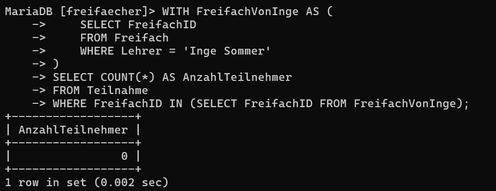
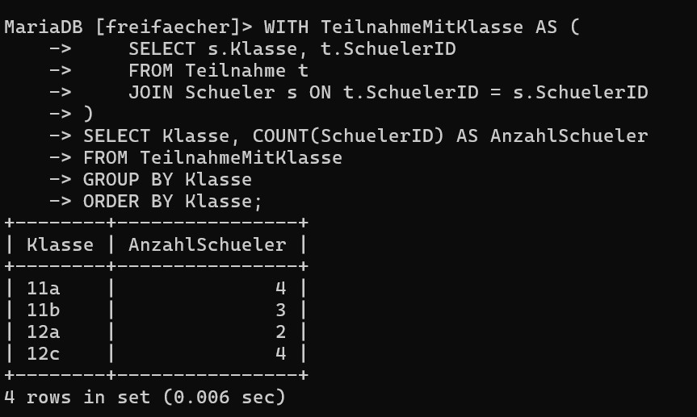
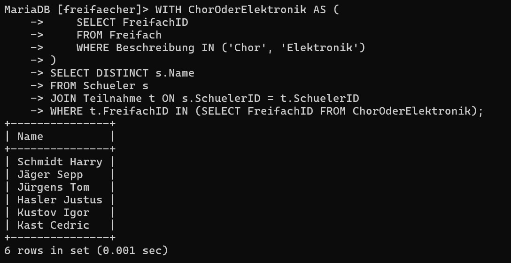
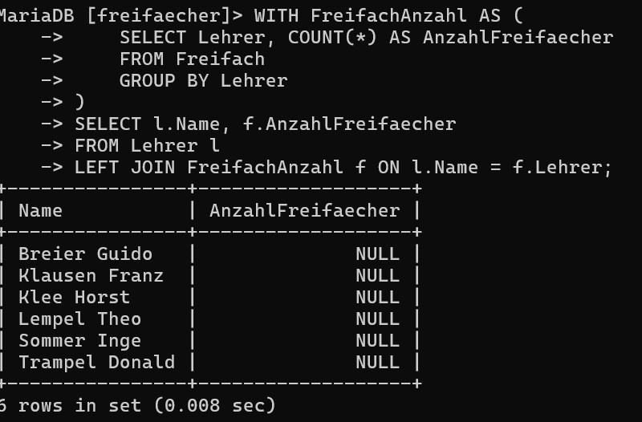
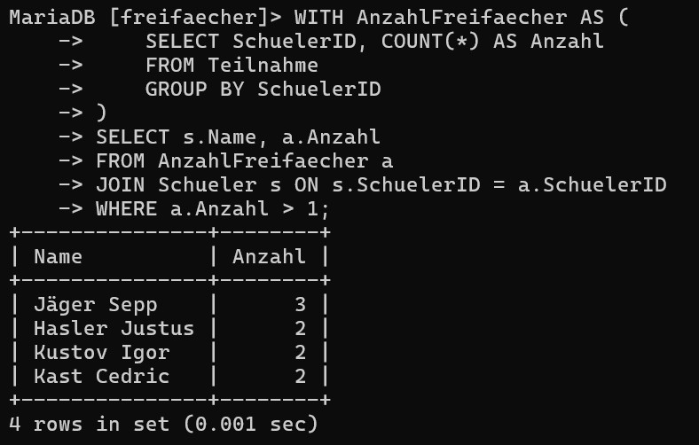
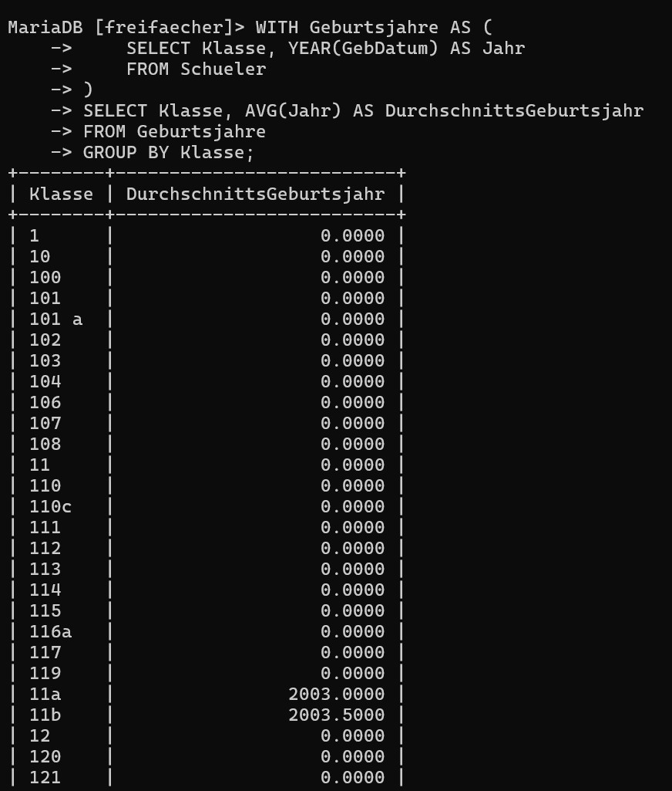
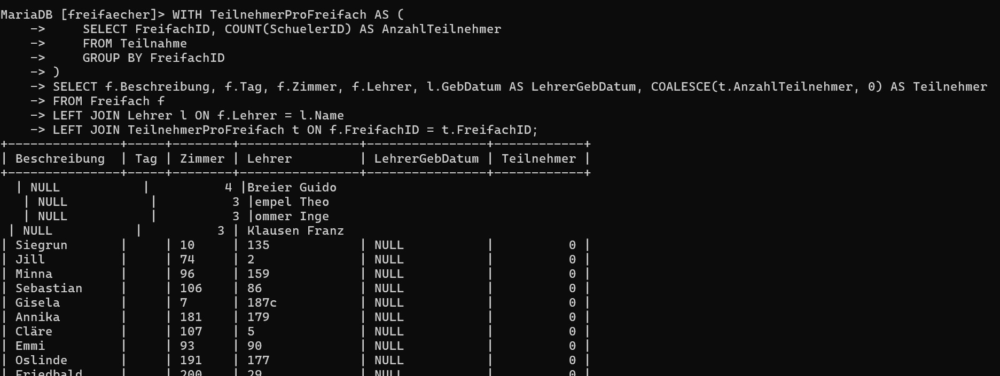

## CTE Auftrag

##  Was ist ein CTE?

Ein CTE ist ein **temporäres Resultat**, das mit dem Schlüsselwort `WITH` einleitest – ideal, um Teile der Abfrage **vorzubereiten oder mehrfach zu verwenden**.

---

##  Aufgabe 1: Anzahl Teilnehmer bei Inge Sommer (mit CTE)

```sql
WITH FreifachVonInge AS (
    SELECT FreifachID
    FROM Freifach
    WHERE Lehrer = 'Inge Sommer'
)
SELECT COUNT(*) AS AnzahlTeilnehmer
FROM Teilnahme
WHERE FreifachID IN (SELECT FreifachID FROM FreifachVonInge);
```


---

### Aufgabe 2: Klassen mit Anzahl SchülerInnen (mit CTE)

```sql
WITH TeilnahmeMitKlasse AS (
    SELECT s.Klasse, t.SchuelerID
    FROM Teilnahme t
    JOIN Schueler s ON t.SchuelerID = s.SchuelerID
)
SELECT Klasse, COUNT(SchuelerID) AS AnzahlSchueler
FROM TeilnahmeMitKlasse
GROUP BY Klasse
ORDER BY Klasse;
```


---

### Aufgabe 3: SchülerInnen im Freifach "Chor" oder "Elektronik" (mit CTE)

```sql
WITH ChorOderElektronik AS (
    SELECT FreifachID
    FROM Freifach
    WHERE Beschreibung IN ('Chor', 'Elektronik')
)
SELECT DISTINCT s.Name
FROM Schueler s
JOIN Teilnahme t ON s.SchuelerID = t.SchuelerID
WHERE t.FreifachID IN (SELECT FreifachID FROM ChorOderElektronik);
```


---

### Beispiel 4: Alle Lehrer mit Anzahl ihrer Freifächer (CTE mit JOIN + GROUP BY)

```sql
WITH FreifachAnzahl AS (
    SELECT Lehrer, COUNT(*) AS AnzahlFreifaecher
    FROM Freifach
    GROUP BY Lehrer
)
SELECT l.Name, f.AnzahlFreifaecher
FROM Lehrer l
LEFT JOIN FreifachAnzahl f ON l.Name = f.Lehrer;
```



---

### Beispiel 5: Alle SchülerInnen, die **mehr als 1 Freifach** belegen

```sql
WITH AnzahlFreifaecher AS (
    SELECT SchuelerID, COUNT(*) AS Anzahl
    FROM Teilnahme
    GROUP BY SchuelerID
)
SELECT s.Name, a.Anzahl
FROM AnzahlFreifaecher a
JOIN Schueler s ON s.SchuelerID = a.SchuelerID
WHERE a.Anzahl > 1;
```


---

### Beispiel 6: Alle Klassen mit durchschnittlichem Geburtsjahr der SchülerInnen

```sql
WITH Geburtsjahre AS (
    SELECT Klasse, YEAR(GebDatum) AS Jahr
    FROM Schueler
)
SELECT Klasse, AVG(Jahr) AS DurchschnittsGeburtsjahr
FROM Geburtsjahre
GROUP BY Klasse;
```


---

### Beispiel 7: Alle Freifächer mit **vollständiger Information** (inkl. Lehrer & Teilnehmeranzahl)

```sql
WITH TeilnehmerProFreifach AS (
    SELECT FreifachID, COUNT(SchuelerID) AS AnzahlTeilnehmer
    FROM Teilnahme
    GROUP BY FreifachID
)
SELECT f.Beschreibung, f.Tag, f.Zimmer, f.Lehrer, l.GebDatum AS LehrerGebDatum, COALESCE(t.AnzahlTeilnehmer, 0) AS Teilnehmer
FROM Freifach f
LEFT JOIN Lehrer l ON f.Lehrer = l.Name
LEFT JOIN TeilnehmerProFreifach t ON f.FreifachID = t.FreifachID;
```


---

Natürlich, hier ist der Text in einfacher Sprache und **ohne Anrede** formuliert:

---

# Stored Procedure?

Eine Stored Procedure (auf Deutsch: gespeicherte Prozedur) ist eine gespeicherte Abfolge von SQL-Befehlen, die direkt in der Datenbank liegt. Sie wird verwendet, um bestimmte Aufgaben automatisch und wiederholt auszuführen.

Beispiele für solche Aufgaben sind Abfragen über eine oder mehrere Tabellen, Berechnungen wie **MAX**, **AVG** oder **Zählungen**.

---

## Vorteile:

* **Wiederverwendbarkeit**: Einmal erstellt, kann eine Prozedur beliebig oft verwendet werden, ohne den SQL-Code neu zu schreiben.
* **Zentrale Verwaltung**: Die Logik wird in der Datenbank gespeichert. Das erleichtert die Verwaltung.
* **Bessere Leistung**: Da die Prozedur direkt auf der Datenbank ausgeführt wird, ist sie schneller als einzelne SQL-Befehle, die erst vom Programm geschickt werden müssen.
* **Mehr Sicherheit**: Benutzer können so eingerichtet werden, dass sie nur die gespeicherten Prozeduren aufrufen dürfen – nicht aber direkt auf die Tabellen zugreifen können.

---

 #### Ein einfaches Beispiel in **MySQL**:

```sql
DELIMITER //
CREATE PROCEDURE zeige_max_note()
BEGIN
  SELECT MAX(Note) FROM Noten;
END //
DELIMITER ;
```

Diese Prozedur kann später mit folgendem Befehl gestartet werden:

```sql
CALL zeige_max_note();
```
