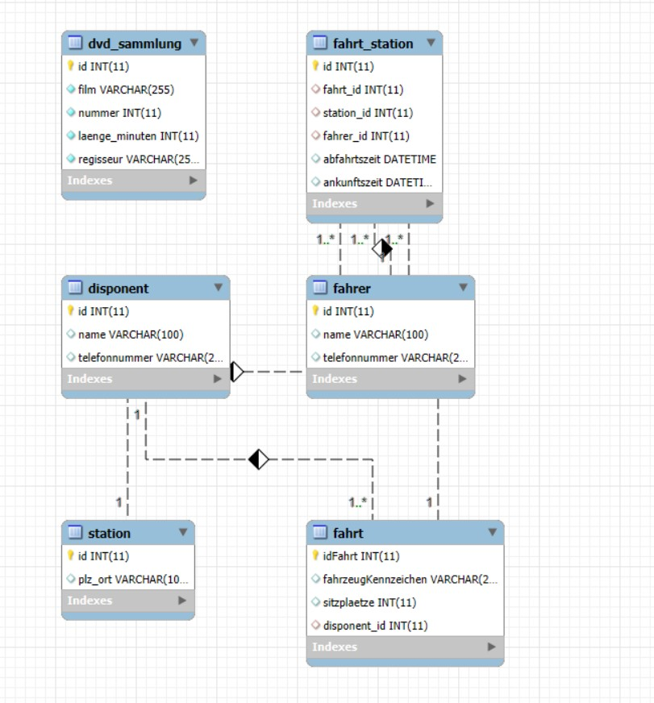

### Beziehungen:

Eine Fahrt hat genau einen Disponenten.

Eine Fahrt kann mehrere Stationen haben (über fahrt_station).

Jede Station hat eine Abfahrts- und Ankunftszeit, sowie einen Fahrer.

Disponenten und Fahrer sind eigene Entitäten (Tabellen) – keine redundanten Texte mehr.

